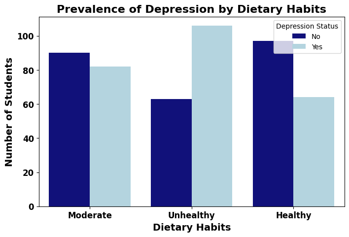
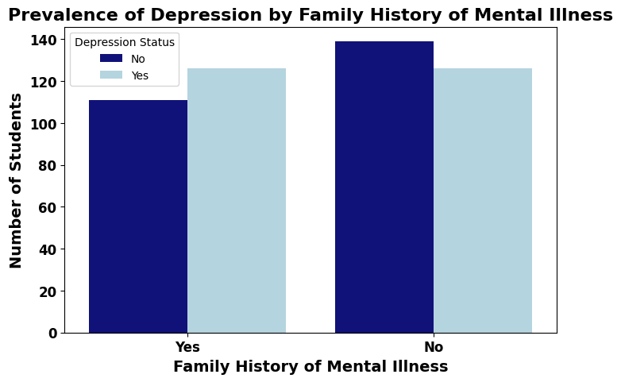
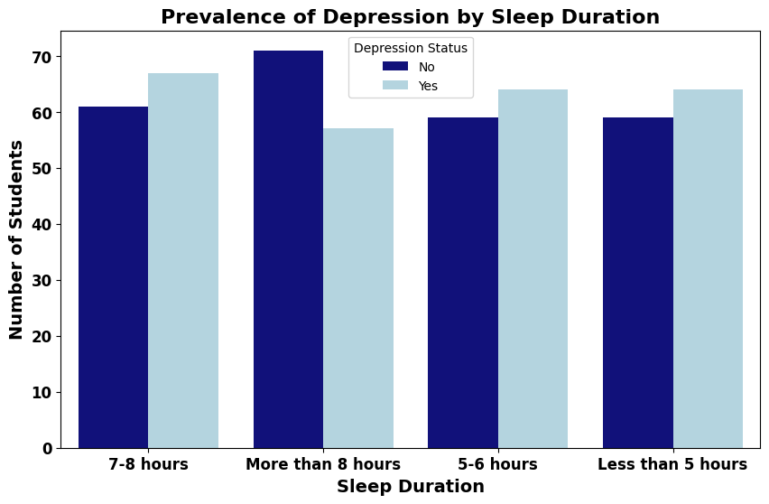

# 🧠 EDA PROJECT 4
# Mind Matters: Analyzing the Factors Influencing Student Depression

## 📌 Project Overview
This project presents an exploratory data analysis of the "Depression Student Dataset," investigating the complex interplay between mental health and various demographic, academic, and lifestyle factors affecting students.

The dataset, encompassing 502 entries and 11 features, provides a comprehensive basis to examine the influence of factors such as gender, age, academic pressures, study habits, sleep duration, dietary habits, and personal history on student mental well-being.

Through rigorous data cleaning, preparation, and visualization, this analysis explores key distributions and relationships, quantifying the prevalence of depression across diverse student demographics. The insights derived from this project are essential for a deeper understanding of the multifaceted nature of student depression, potentially guiding the development of targeted interventions and support strategies to enhance mental health outcomes within academic settings.

---

## 🧰 Tools & Libraries
- **Python** (Jupyter Notebook)  
- **pandas**, **numpy** for data wrangling  
- **matplotlib**, **seaborn** for visualization  
- (optional) **scikit-learn** for basic preprocessing & later modeling

---

## ❓ Key Exploratory Questions Addressed
- What is the distribution of depression status in the student population?
- How does the prevalence of depression differ between male and female students?
- What is the typical sleep duration among students, and how does it relate to depression?
- Do dietary habits have an association with depression status?
- How does a family history of mental illness influence the likelihood of depression in students?
- Are students who have had suicidal thoughts more likely to be diagnosed with depression?

---

## 📊 Key Findings and Implications

**Based on the exploratory data analysis of the Student Depression Dataset, the following key findings and implications can be highlighted:**

**1. Prevalence of Depression:**
- The student population in this dataset exhibits a nearly balanced distribution of depression status, with a significant number of students reporting having depression.
- **Implication:** This highlights that depression is a prevalent concern within this student group, necessitating attention and support strategies.

**2. Gender and Depression:**
- While both male and female students report depression, a slightly higher number of male students reported having depression in this dataset.
- **Implication:** Further investigation may be needed to understand the factors contributing to this difference and to tailor interventions appropriately for each gender.

**3. Sleep Duration and Depression:**
- There appears to be a potential association between shorter sleep durations ('Less than 5 hours', '5-6 hours', '7-8 hours') and a higher prevalence of depression. Conversely, longer sleep duration ('More than 8 hours') seems associated with a lower prevalence.
- **Implication:** Promoting healthy sleep habits and providing resources for students struggling with sleep could be crucial in mitigating depression risk.

**4. Dietary Habits and Depression:**
- Students with 'Unhealthy' dietary habits show a considerably higher number of students with depression, while 'Healthy' dietary habits are associated with a lower prevalence.
- **Implication:** Encouraging and supporting healthy eating habits among students could be a valuable component of mental well-being initiatives.

**5. Family History of Mental Illness and Depression:**
- While a family history of mental illness might play a role, it did not appear to be as strong a predictor of depression in this dataset compared to factors like diet or sleep duration.
- **Implication:** While family history is a consideration, focusing on modifiable lifestyle factors might be more impactful for broad intervention strategies in this population.

**6. Suicidal Thoughts and Depression:**
- There is a strong association between having suicidal thoughts and being diagnosed with depression.
- **Implication:** This finding underscores the critical need for mental health support systems to include screening for suicidal ideation and providing immediate, accessible resources for students who report such thoughts.

**7. Age, Academic Pressure, Study Satisfaction, and Financial Stress:**
- No clear linear relationship was observed between age and academic pressure or between study hours and study satisfaction.
- Academic pressure and financial stress appear to have a slight upward trend with increasing financial stress, and students with depression reported higher mean academic pressure and financial stress, and lower mean study satisfaction.
- **Implication:** These factors are complex and interconnected, and interventions should consider the cumulative impact of academic demands, financial burdens, and study experiences on student mental health.

---

## 📸 Visuals (displayed in README)

| Prevalence of Depression by Gender | Prevalence of Depression by Dietary Habits |
|----------------------|----------------|
|  |  |

| Prevalence of Depression by Family History of Mental Illness | Prevalence of Depression by Sleep Duration |
|----------------------------------|----------------|
|  |  |

---

## 📁 Files in This Repository
- `EDA4_Student_Mental_Health.ipynb` — Jupyter notebook with full exploratory analysis (data cleaning, plots, summary tables)  
- `images/` — PNG exports used in README (`by gender.png`, `by dietary habits.png`, `by family history of mental illness.png`, `by sleep duration.png`)  
- `data/` — full/raw csv dataset  
- `README.md` — this document

---

## 📂 Dataset Access
You can access it here:
👉 [Student Mental Health Dataset](https://www.kaggle.com/datasets/ikynahidwin/depression-student-dataset?resource=download)

---

## 🚀 Next Steps (recommended future works)
1. **Statistical testing & confounding control** — run chi-squared tests or logistic regression models to adjust associations for age, socio-economic status, and other covariates.  
2. **Feature engineering** — combine related diet or sleep variables, and create standardized sleep-score and diet-score features.  
3. **Modeling** — build classification models (logistic regression, random forest) to predict depression risk; evaluate with precision, recall, ROC-AUC, and calibration.  
4. **Actionable reporting** — translate findings into short guidance notes for student services (e.g., screening questions about sleep and family history).  

---

## ✍️ Author
**Dr. Adebayo Fashina**  
[GitHub](https://github.com/dradebayotech) | [LinkedIn](https://www.linkedin.com/in/your-link-here)

---
